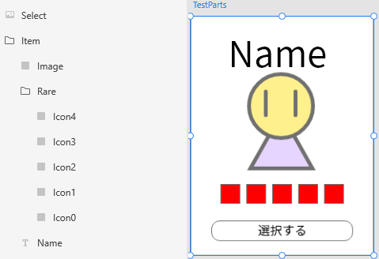
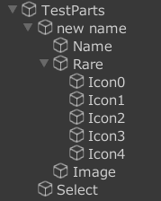
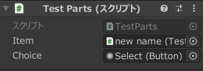
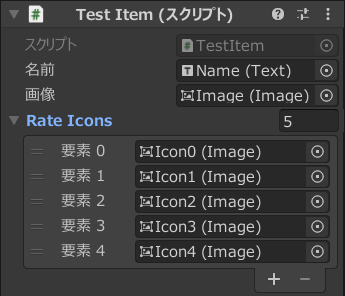

# BindableLayoutTrigger

BindableLayoutTriggerは、[AkyuiUnity](https://github.com/kyubuns/AkyuiUnity)のトリガーです

## どんなトリガーなの？

AkyuiUnityでプレハブを作成する時に、プレハブにスクリプトを追加するトリガーです  

### 使い方

AkyuiUnityは設定済みとする  

1. このリポジトリのLayoutフォルダをUnityProjectのAssets下にコピーする
1. トリガーを作成＆設定する
1. 追加するスクリプトを準備する
1. AkyuiUnityのインポートトリガーに作成したトリガーを設定する
1. AkyuiUnityで変換する

### トリガーの作成

Unityのプロジェクトウインドウを右クリック>Create>Akyui>Trigger>Layoutを選択することで作成することができます

### トリガーの設定

プレハブに追加するスクリプトは、完全修飾のクラス名を検索します  
その為、トリガーのClassNameは完全修飾のクラス名を設定してください  
※名前解決時にClassNameの{name}は、アートボード名(プレハブ名)として扱います  

サンプル(Sample/*.cs)の場合は、ネームスペースがSampleなのでTestPartsのフルネームはSample.TestPartsです  
ClassNameをSample.{name}とすることで、Sample.[アートボード名]のスクリプトをルートオブジェクトにスクリプトコンポーネントとして追加されます  

### トリガーの機能

- ルートオブジェクトにスクリプトを追加する(後述)  
- 追加するスクリプトのフィールドにLayoutPath属性を記述することで自動的にフィールドに設定される  
- 指定されたパスのGameObjectにフィールド型のコンポーネントが無い場合は自動的にフィールド型のコンポーネントが追加される  
- レイアウトパスのレイヤ名に*(ワイルドカード)で一致するものを配列としてバインドできる
  
  配列の要素は、レイヤ名昇順で格納される

  ```C#
  // プレハブのヒエラルキー
  // + Hoge
  //  - Item
  //  - Icon0
  //  - Icon1
  //  - Icon2

  // この場合、プレハブのHoge/ItemのGameObjectにコンポーネント「HogeItem」が追加される
  // ※HogeItemはコンポーネントとして追加するのでMonoBehaviourを継承したが必要
  [SerializeField, LayoutPath("Hoge/Item")] private HogeItem Item;
  // コンポーネントだけではなく、GameObject自体もバインドできる
  [SerializeField, LayoutPath("Hoge")] private GameObject Hoge;
  // 同じコンポーネントは配列としてバインドできる
  // Icons = [Icon0, Icon1, Icon2]
  [SerializeField, LayoutPath("Hoge/Icon*")] private Image[] Icons;
  ```

[サンプルコード参照(TestParts.cs)](Sample/TestParts.cs)  
[サンプルコード参照(TestItem.cs)](Sample/TestItem.cs)  

## レイアウトパスの補助機能(Layout/Editor/EditorMenu.cs)

ヒエラルキーのオブジェクトを選択して右クリックでレイアウトパスのコピーでレイアウトバインド用のコードがクリップボードにコピーできます  

## 再帰的バインド

LayoutPath属性を持つフィールドでフィールド型が以下の条件を満たす場合は再帰的に処理される  
※再帰時は、再帰オブジェクトがルートになります  

- BindableLayoutAttributeを持つクラス
  ```C#
  [BindableLayout]
  public class TestItem : MonoBehaviour {}
  ```
- Layoutを継承したクラス
  ```C#
  public class TestParts : Layout {}
  ```

## 設定するオブジェクトのカスタマイズ

Layoutクラスを継承してSetupLayoutをoverrideすることで、プレハブの加工が行えます

## サンプルトリガーの実行結果

### Xdのレイヤ

<br/>  

### プレハブ

<br/>  

### TestPartsのインスペクタ

<br/>  


### TestParts/TestItem(new name)のインスペクタ
<br/>  

## FAQ

Q. 何でパッケージじゃないの？  
A. ……(時間が無くて難しいでのです？)  

Q. metaファイルがないよ？  
A. アセットの参照もないから付けていません  
　そもそもスクリプトやフォルダにmetaファイルって不要にできるんじゃ…  
　実際、Godotは特定のファイル以外はメタファイルないんですよね  

Q. AnKuchenでよいのでは？  
A. もう少し、こぢんまりした仕組みが欲しかったのと  
　普段の手法に近い方が学習コストが少ない方法があってもよいのかなぁと  

## ライセンス

MIT License

